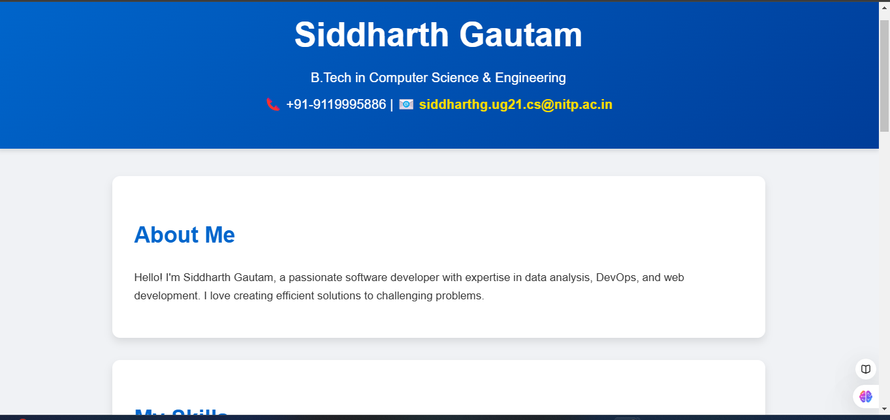
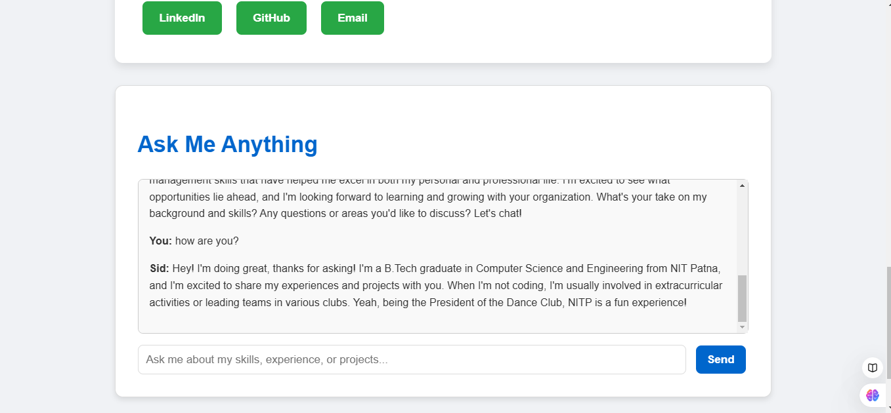

# Portfolio-Chatbot

A portfolio chatbot integrated with a beautiful, responsive portfolio website. This chatbot is designed to answer queries about my resume, skills, projects, and achievements using an open-source LLM (Groq AI). The project is built using Flask, HTML, CSS, and JavaScript and is deployed on Render for free hosting.

## Screenshots

---
## Features

### Interactive Portfolio Website:
- Brief introduction about me.
- List of my key technical and soft skills.
- Resume available for download in PDF format.
- Contact buttons for LinkedIn, GitHub, and Email.

### AI Chatbot:
- Answers queries about my resume, experience, skills, and achievements.
- Powered by Groq AI LLM with structured prompt engineering.
- Responds like "Siddharth Gautam," adding a personal touch.

### Responsive Design:
- Works seamlessly on both desktop and mobile devices.

### Deployed Online:
- Hosted using Render for free.

---

## Technologies Used

Frontend:
- HTML5: For the webpage structure.
- CSS3: For styling and responsiveness.
- JavaScript: To handle chatbot interactions on the frontend.

Backend:
- Python 3.10: Backend logic and server-side scripting.
- Flask: Lightweight web framework for routing and API endpoints.
- Groq AI: LLM integration for chatbot functionality.

---
## Project Structure

PortfolioProject/
- files/
  - resume.pdf          # Resume file for download
- static/
  - script.js           # JavaScript for chatbot functionality
  - style.css           # Stylesheet for the website
- templates/
  - index.html          # HTML file for the portfolio
- .env                  # Environment variables (e.g., API keys)
- requirements.txt      # Python dependencies
- runtime.txt           # Python runtime version (3.10)
- Procfile              # For deployment on Render
- server.py             # Flask backend for API and chatbot
- README.md             # Project documentation

---

### How to Run Locally

Prerequisites:
1. Python 3.10 installed on your system.
2. A valid GROQ_API_KEY from Groq AI (https://www.together.xyz/).
3. Node.js installed (optional, for frontend development).

Steps:
1. Clone the Repository:
   git clone https://github.com/siddharth-gautam-ug21-007-nitp/your-repo-name.git
   cd your-repo-name

2. Set Up the Backend:
   - Install dependencies:
     pip install -r requirements.txt
   - Create a .env file in the root directory and add your Groq API key:
     GROQ_API_KEY=your_groq_api_key

3. Run the Application Locally:
   - Start the Flask server:
     python3.10 server.py
   - Open http://127.0.0.1:5000 in your browser.

---
## Deployment on Render

Push Your Code to GitHub:
1. Initialize Git:
   git init
   git add .
   git commit -m "Initial commit"
   git remote add origin https://github.com/your-username/your-repo-name.git
   git push -u origin main

2. Deploy on Render:
   - Go to Render (https://render.com).
   - Create a New Web Service and connect your GitHub repository.
   - Add GROQ_API_KEY in the Environment Variables.
   - Set the Start Command to:
     python server.py
   - Render will handle the rest.

3. Access your deployed site at the URL provided by Render.

---

## Contact

Feel free to connect with me:

- Email: siddharthg.ug21.cs@nitp.ac.in
- LinkedIn: https://www.linkedin.com/in/siddharth-gautam2106007/
